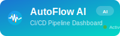

<div align="center">
  
  
  # AutoFlow AI - CI/CD Pipeline Health Dashboard
  
  <p>A comprehensive, real-time CI/CD Pipeline Health Dashboard built with modern web technologies.<br/>
  Monitor your GitHub workflows, track build metrics, and receive instant notifications - all in one intelligent dashboard.</p>
  
  <!-- Technology Badges -->
  <p>
    
    
    
    
    
  </p>
  
  <!-- Status Badges -->
  <p>
    
    
    
    
  </p>
  
  <!-- Feature Badges -->
  <p>
    
    
    
    
    
  
  
  
</div>

## 🏗️ Architecture Overview

<div align="center">
  
  <p><em>High-level system architecture showing component interactions</em></p>
</div>

### System Components

The application follows a modern three-tier architecture:

1. **Frontend Layer** - React.js application with Material-UI components
2. **API Layer** - Node.js/Express.js backend with RESTful endpoints
3. **Data Layer** - SQLite database with external service integrations

<div align="center">
  
  <p><em>Data flow and real-time communication patterns</em></p>
</div>

### Key Architectural Features

- **Real-time Communication** - WebSocket integration for live updates
- **GitHub Integration** - OAuth authentication and webhook processing  
- **Email Notifications** - SMTP service for alerts and OTP delivery
- **Session Management** - Secure user authentication and authorization
- **Containerized Deployment** - Docker configuration for easy scaling

## 🚀 Features

- **Real-time Pipeline Monitoring** - Live updates via WebSocket connections
- **GitHub Integration** - OAuth authentication and workflow synchronization
- **Interactive Dashboards** - Rich visualizations with charts and metrics
- **Alert Management** - Email notifications for pipeline events
- **Execution Tracking** - Detailed build logs and execution history
- **Responsive Design** - Modern UI that works on all devices

## 🛠️ Tech Stack

<table>
<tr>
<td align="center" width="50%">

### 🔧 Backend Technologies
<p>
  <br/>
  <br/>
  <br/>
  <br/>
  <br/>
  
</p>

</td>
<td align="center" width="50%">

### ⚛️ Frontend Technologies
<p>
  <br/>
  <br/>
  <br/>
  <br/>
  <br/>
  
</p>

</td>
</tr>
<tr>
<td align="center" colspan="2">

### 🚀 DevOps & Tools
<p>
  
  
  
  
  
</p>

### 🤖 AI Development Tools
<p>
  
  
</p>

</td>
</tr>
</table>

## 🚀 Quick Start

### Prerequisites
- Node.js 16+ and npm
- Docker and Docker Compose
- GitHub account for OAuth setup

### 1. Clone and Setup
```bash
git clone <repository-url>
cd AutoFlow-AI
cp .env.example .env
```

### 2. Configure Environment Variables
Edit `.env` file with your credentials:
```bash
# GitHub OAuth (create at https://github.com/settings/applications/new)
GITHUB_CLIENT_ID=your-github-client-id
GITHUB_CLIENT_SECRET=your-github-client-secret

# Email Configuration
SMTP_USER=your-email@gmail.com
SMTP_PASS=your-app-password
```

### 3. Run with Docker
```bash
docker-compose up -d
```

The application will be available at:
- Frontend: http://localhost:3000
- Backend API: http://localhost:5000

## Setup Instructions

### GitHub OAuth Setup
1. Go to GitHub Settings > Developer settings > OAuth Apps
2. Create a new OAuth App with:
   - Homepage URL: `http://localhost:3000`
   - Authorization callback URL: `http://localhost:5000/auth/github/callback`
3. Copy Client ID and Secret to your `.env` file

### Email Configuration
1. Enable 2-factor authentication on your Gmail account
2. Generate an App Password for AutoFlow AI
3. Add your email and app password to `.env` file

### Manual Setup (without Docker)

#### Backend Setup
```bash
cd backend
npm install
npm run dev
```

#### Frontend Setup
```bash
cd frontend
npm install
npm start
```

## Project Structure

```
AutoFlow-AI/
├── backend/                 # Node.js/Express backend
│   ├── config/             # Configuration files
│   ├── middleware/         # Custom middleware
│   ├── models/             # Database models
│   ├── routes/             # API routes
│   ├── services/           # Business logic services
│   └── server.js           # Main server file
├── frontend/               # React.js frontend
│   ├── public/             # Static assets
│   ├── src/
│   │   ├── components/     # Reusable components
│   │   ├── pages/          # Page components
│   │   ├── services/       # API services
│   │   └── contexts/       # React contexts
├── docs/                   # Documentation
├── screenshots/            # Application screenshots
└── docker-compose.yml     # Docker configuration
```

## API Documentation

### Authentication Endpoints
- `GET /auth/github` - Initiate GitHub OAuth
- `GET /auth/github/callback` - OAuth callback
- `GET /api/auth/status` - Check authentication status
- `POST /api/auth/logout` - Logout user

### Pipeline Management
- `GET /api/pipelines` - Get all pipelines
- `POST /api/pipelines` - Create new pipeline
- `PUT /api/pipelines/:id` - Update pipeline
- `DELETE /api/pipelines/:id` - Delete pipeline

### Execution Tracking
- `GET /api/executions` - Get execution history
- `GET /api/executions/:id` - Get execution details
- `POST /api/executions` - Create execution record

### Metrics and Analytics
- `GET /api/metrics/dashboard` - Dashboard metrics
- `GET /api/metrics/build-trends` - Build trend data

## Screenshots

| Dashboard Overview | Pipeline Management |
|-------------------|-------------------|
|  |  |

| Execution History | Alert Management |
|------------------|-----------------|
|  |  |

## Development

### How AI Tools Were Used

This project was built using **GitHub Copilot** and **Cursor AI** as development assistants:

**GitHub Copilot** helped with:
- Code completion and suggestions
- API endpoint implementations
- React component development
- Database query optimization

**Cursor AI** assisted with:
- Architecture planning and design decisions
- Complex feature implementations
- Debugging and error resolution
- Code refactoring and optimization

### Key Prompts Used

1. **Initial Setup**: "Create a complete full-stack CI/CD dashboard with Node.js backend and React frontend"
2. **GitHub Integration**: "Implement GitHub OAuth authentication and workflow synchronization"
3. **Real-time Features**: "Add WebSocket support for live pipeline status updates"
4. **Docker Configuration**: "Containerize the application with Docker Compose"

## Architecture Overview

The application follows a modern microservices architecture:

1. **Frontend (React)** - Responsive SPA with real-time updates
2. **Backend (Node.js)** - RESTful API with WebSocket support
3. **Database (SQLite)** - Lightweight, file-based storage
4. **GitHub API** - Integration for workflow data
5. **Email Service** - SMTP notifications for alerts

## Database Schema

### Core Tables
- **users** - GitHub authenticated users
- **pipelines** - CI/CD pipeline configurations
- **executions** - Build execution records
- **alert_configs** - Notification preferences

## Deployment

### Docker Deployment
```bash
# Build and start all services
docker-compose up -d

# View logs
docker-compose logs -f

# Stop services
docker-compose down
```

### Development Setup
For local development without Docker:
```bash
# Backend
cd backend && npm install && npm run dev

# Frontend  
cd frontend && npm install && npm start
```

## Contributing

1. Fork the repository
2. Create a feature branch
3. Make your changes
4. Add tests if applicable
5. Submit a pull request

## License

This project is licensed under the MIT License - see the LICENSE file for details.

## Support

For questions and support:
- Create an issue in the GitHub repository
- Check the documentation in the `/docs` folder
- Review the troubleshooting guide

---

<div align="center">
  <h3>🚀 Built with AI-Powered Development</h3>
  <p>
    
    
  </p>
  
  <p>
    <strong>AutoFlow AI</strong> represents a successful demonstration of AI-assisted full-stack development,<br/>
    resulting in a comprehensive CI/CD monitoring solution that teams can deploy and customize for their specific needs.
  </p>
  
  <p>
    
  </p>
  
  <p>
    <em>Transforming CI/CD monitoring with intelligent automation and real-time insights.</em>
  </p>
</div>
